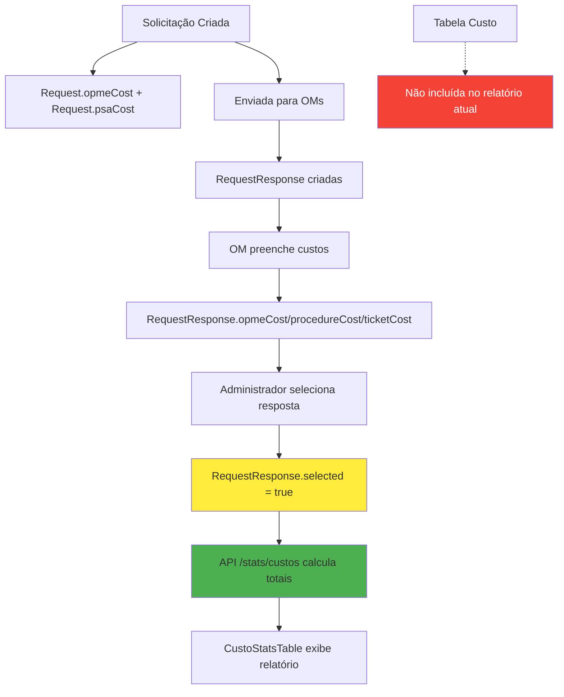

# 📊 ANÁLISE COMPLETA: ORIGEM DOS DADOS DE CUSTO NO RELATÓRIO DE ESTATÍSTICAS

## 🔍 INVESTIGAÇÃO DETALHADA - ATUALIZADA

Com base na análise completa do código fonte, posso explicar exatamente **de onde vêm os dados de custo** exibidos na página de estatísticas e como são calculados.

---

## 📋 FONTE DOS DADOS

### **🎯 API Principal: `/api/stats/custos`**
- **Arquivo**: `/pages/api/stats/custos.ts`
- **Componente Frontend**: `CustoStatsTable` (`/src/components/stats/CustoStatsTable.tsx`)
- **Banco de Dados**: Tabelas `Request`, `RequestResponse` e `Custo`

---

## 💰 ESTRUTURA DE DADOS DE CUSTO

### **1. 📊 Tabela `Request` (Solicitação Principal)**
```prisma
model Request {
  opmeCost  Float    // Custo OPME estimado da solicitação
  psaCost   Float?   // Custo PSA/OCS da solicitação
  // ... outros campos
}
```

### **2. 📋 Tabela `RequestResponse` (Respostas das OMs)**
```prisma
model RequestResponse {
  opmeCost      Float?  // Custo OPME da resposta
  procedureCost Float?  // Custo do procedimento
  ticketCost    Float?  // Custo da passagem
  selected      Boolean // ⚠️ IMPORTANTE: Se esta resposta foi selecionada
  // ... outros campos
}
```

### **3. 💸 Tabela `Custo` (Custos Adicionais)**
```prisma
model Custo {
  descricao String  // Descrição do custo adicional
  valor     Float   // Valor do custo adicional
  requestId String? // Ligação com a solicitação
  // ... outros campos
}
```

---

## 🧮 FÓRMULA DETALHADA DE CÁLCULO DOS CUSTOS

### **📊 Lógica de Cálculo por Solicitação:**
```typescript
// Arquivo: /pages/api/stats/custos.ts (linhas 100-120)

// 1. Custos da solicitação principal
const opmeCostRequest = request.opmeCost || 0;
const psaCostRequest = request.psaCost || 0;

// 2. Custos das respostas APENAS SELECIONADAS (selected = true)
let opmeCostResponse = 0;
let procedureCostResponse = 0;  
let ticketCostResponse = 0;

request.requestResponses.forEach(response => {
  if (response.selected) { // ⚠️ CRITÉRIO: Apenas respostas selecionadas
    opmeCostResponse += response.opmeCost || 0;
    procedureCostResponse += response.procedureCost || 0;
    ticketCostResponse += response.ticketCost || 0;
  }
});

// 3. TOTAL FINAL por solicitação
const totalSolicitacao = 
  opmeCostRequest +      // OPME da solicitação original
  psaCostRequest +       // PSA da solicitação original  
  opmeCostResponse +     // OPME das respostas selecionadas
  procedureCostResponse + // Procedimentos das respostas selecionadas
  ticketCostResponse;    // Passagens das respostas selecionadas
```

### **📈 Agrupamentos e Estatísticas:**

#### **🌍 Por Região Militar (RM):**
- **Identificação**: `request.sender.regionId` (região da OM remetente)
- **Agregação**: Soma de todos os custos das solicitações da região
- **Custo Médio**: `totalRegiao / quantidadeSolicitacoesRegiao`

#### **🏢 Por Organização Militar (OM):**
- **Identificação**: `request.senderId` (organização remetente)
- **Agregação**: Soma de todos os custos das solicitações da organização
- **Custo Médio**: `totalOrganizacao / quantidadeSolicitacoesOrganizacao`

#### **📊 Resumo Geral do Sistema:**
- **Total OPME**: Soma de todos os OPME (solicitações + respostas)
- **Total PSA**: Soma de todos os PSA das solicitações
- **Total Procedimentos**: Soma de todos os procedimentos das respostas
- **Total Passagens**: Soma de todas as passagens das respostas
- **Custo Médio Geral**: `totalGeral / quantidadeToalSolicitacoes`

---

## 📋 COMPOSIÇÃO DOS CUSTOS

### **✅ Custos INCLUÍDOS no Relatório:**

1. **💊 OPME Solicitação**: `Request.opmeCost` - Custo estimado informado na criação
2. **🏥 PSA/OCS**: `Request.psaCost` - Custo de PSA ou OCS
3. **💊 OPME Resposta**: `RequestResponse.opmeCost` - Custo real informado pela OM destinatária  
4. **⚕️ Custo Procedimento**: `RequestResponse.procedureCost` - Custo do procedimento médico
5. **✈️ Custo Passagem**: `RequestResponse.ticketCost` - Custo de transporte/passagem

### **❌ Custos NÃO INCLUÍDOS no Relatório Atual:**
- **💸 Custos Adicionais**: Tabela `Custo` - custos extras cadastrados posteriormente
- **🚫 Respostas Não Selecionadas**: `RequestResponse` onde `selected = false`

---

## 🔄 FILTROS E CRITÉRIOS APLICADOS

### **📅 Filtros de Data:**
```typescript
// Arquivo: /pages/api/stats/custos.ts (linhas 35-42)
const dateFilter: any = {};
if (startDate) {
  dateFilter.gte = new Date(startDate as string);
}
if (endDate) {
  const endDateTime = new Date(endDate as string);
  endDateTime.setHours(23, 59, 59, 999); // Inclui todo o dia final
  dateFilter.lte = endDateTime;
}
// Aplica em: request.createdAt
```

### **🌍 Filtros de Região:**
```typescript
// Filtra por região da organização REMETENTE
WHERE request.sender.regionId IN (selectedRegions)
```

### **🏢 Filtros de Organização:**
```typescript
// Filtra por organização REMETENTE específica
WHERE request.sender.id IN (selectedOrganizations)
```

### **⚡ Critério CRUCIAL - Respostas Selecionadas:**
```typescript
// Arquivo: /pages/api/stats/custos.ts (linha 61)
requestResponses: {
  where: {
    selected: true // ⚠️ APENAS respostas selecionadas
  },
  include: {
    receiver: { include: { region: true } }
  }
}
```

---

## 📊 ESTRUTURA COMPLETA DOS DADOS RETORNADOS

```typescript
// Resposta da API /api/stats/custos
{
  custosPorRM: [ // Custos agrupados por Região Militar
    {
      id: "1RM",
      name: "1ª Região Militar", 
      totalOPME: 150000.00,      // OPME total da região
      totalPSA: 50000.00,        // PSA total da região
      totalProcedure: 75000.00,  // Procedimentos total da região
      totalTicket: 25000.00,     // Passagens total da região
      totalGeral: 300000.00,     // Soma de todos os custos
      quantidadeSolicitacoes: 150, // Quantidade de solicitações
      custoMedio: 2000.00        // totalGeral / quantidade
    }
  ],
  custosPorOM: [ // Custos agrupados por Organização Militar
    {
      id: "org-uuid-123",
      name: "Hospital Central do Exército",
      regionName: "1ª Região Militar",
      totalOPME: 80000.00,
      totalPSA: 20000.00, 
      totalProcedure: 40000.00,
      totalTicket: 10000.00,
      totalGeral: 150000.00,
      quantidadeSolicitacoes: 75,
      custoMedio: 2000.00
    }
  ],
  resumoGeral: { // Resumo geral do sistema
    totalOPME: 500000.00,        // Soma de TODOS os OPME
    totalPSA: 200000.00,         // Soma de TODOS os PSA
    totalProcedure: 300000.00,   // Soma de TODOS os procedimentos  
    totalTicket: 100000.00,      // Soma de TODAS as passagens
    totalGeral: 1100000.00,      // TOTAL GERAL do sistema
    quantidadeSolicitacoes: 500, // Quantidade total de solicitações
    custoMedio: 2200.00          // Custo médio geral
  },
  periodo: { // Período filtrado
    inicio: "2024-01-01",
    fim: "2024-12-31"
  },
  filtros: { // Filtros aplicados
    regioes: ["1RM", "2RM"],
    organizacoes: ["org-1", "org-2"]
  }
}
```

---

## ⚠️ OBSERVAÇÕES IMPORTANTES

### **🎯 Pontos Críticos Identificados:**

1. **Respostas Selecionadas**: Apenas respostas com `selected = true` são incluídas
2. **Custos Adicionais Ignorados**: Tabela `Custo` não é considerada no cálculo
3. **Data de Criação**: Filtros aplicam apenas na data de criação da solicitação
4. **Organização Remetente**: Agrupamentos baseados na OM que ENVIA a solicitação

### **🔍 Para Auditoria e Validação:**

```sql
-- Query para verificar custos de uma solicitação específica
SELECT 
  r.id,
  r.opmeCost as opme_solicitacao,
  r.psaCost as psa_solicitacao,
  rr.opmeCost as opme_resposta,
  rr.procedureCost as custo_procedimento,
  rr.ticketCost as custo_passagem,
  rr.selected as resposta_selecionada
FROM Request r
LEFT JOIN RequestResponse rr ON r.id = rr.requestId
WHERE r.id = 'ID_DA_SOLICITACAO';
```

---

## 📈 FLUXO COMPLETO DOS DADOS



---

## ✅ CONCLUSÃO

Os dados de custo do sistema DSAU são calculados com base em:
- **Custos das solicitações originais** (OPME + PSA)
- **Custos das respostas selecionadas** (OPME + Procedimentos + Passagens)
- **Filtros por data, região e organização**
- **Agrupamentos por RM e OM remetentes**

A tabela `Custo` existe no banco mas **não é utilizada** no cálculo atual das estatísticas. O sistema considera apenas custos diretamente relacionados às solicitações e suas respostas aprovadas/selecionadas.
      id: "1RM",
      name: "1ª Região Militar",
      totalOPME: 150000,      // Soma OPME solicitação + resposta
      totalPSA: 50000,        // Soma PSA/OCS
      totalProcedure: 75000,  // Soma custos de procedimentos
      totalTicket: 25000,     // Soma custos de passagens
      totalGeral: 300000,     // Soma de todos os custos
      quantidadeSolicitacoes: 10,
      custoMedio: 30000       // totalGeral / quantidade
    }
  ],
  custosPorOM: [ /* estrutura similar por organização */ ],
  resumoGeral: {
    totalOPME: 500000,
    totalPSA: 200000,
    totalProcedure: 300000,
    totalTicket: 100000,
    totalGeral: 1100000,
    quantidadeSolicitacoes: 50,
    custoMedio: 22000
  }
}
```

---

## 💡 OBSERVAÇÕES IMPORTANTES

### **🎯 Dados Considerados:**
- ✅ Apenas solicitações que atendem aos filtros aplicados
- ✅ Apenas respostas marcadas como `selected = true`
- ✅ Custos em centavos (convertidos para reais na exibição)
- ✅ Dados ordenados por custo médio (decrescente)

### **⚠️ Limitações Atuais:**
- ❌ Custos adicionais da tabela `Custo` **NÃO** são incluídos no relatório
- ⚠️ Se uma solicitação não tem resposta selecionada, apenas custos da solicitação são considerados

### **🔧 Possíveis Melhorias:**
- Incluir custos adicionais da tabela `Custo`
- Adicionar breakdown mais detalhado por tipo de custo
- Incluir métricas de custos por período (mensal/trimestral)

---

## 🎯 RESUMO EXECUTIVO

**Os dados de custo vêm de:**
1. **Campos de custo das solicitações** (`Request.opmeCost`, `Request.psaCost`)
2. **Campos de custo das respostas selecionadas** (`RequestResponse.opmeCost`, `procedureCost`, `ticketCost`)
3. **Aplicação de filtros** de data, região e organização
4. **Agrupamento automático** por RM e OM com cálculo de médias

**Não incluem atualmente:**
- Custos adicionais da tabela `Custo`

**Fonte de Dados**: Sistema de solicitações de evacuação médica do DSAU
